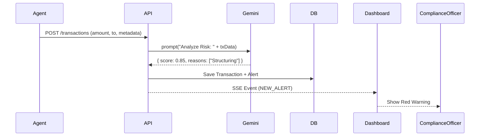

# System Architecture: Nexus Lend Compliance Terminal

## 🏗️ High-Level Overview
Nexus Lend is an AI-native compliance operating system designed for the "Agentic Commerce" era. It acts as an intermediary layer between autonomous AI agents and regulated financial networks (like Circle's Arc Network).

### Core Components
1.  **Compliance Dashboard (Frontend)**: Next.js 14 application providing real-time visibility into agent activities.
2.  **Risk Engine (AI Layer)**: Google Gemini 2.0-powered analysis service that scores transactions on a 0-1 risk scale.
3.  **Audit Ledger (Blockchain)**: Immutable log of all compliance actions (Freeze, Approve, SAR) stored on the Arc Network.
4.  **Transaction Bridge (Payments)**: Circle Programmable Wallets & CCTP for secure, traceable fund movement.

---

## 🔧 Technology Stack

| Layer | Technology | Purpose |
| :--- | :--- | :--- |
| **Frontend** | **Next.js 14** (App Router) | React framework for server-side rendering and routing. |
| **UI Framework** | **Shadcn/UI + Tailwind** | Accessible, clean component library. |
| **State Mgmt** | **SWR + SSE** | Stale-While-Revalidate fetching + Server-Sent Events for real-time updates. |
| **AI Model** | **Google Gemini 2.0 Flash** | High-speed, low-latency risk scoring and text generation. |
| **Identity/Wallets** | **Circle Programmable Wallets** | MPC-based wallets for agents; enables cryptographic signing. |
| **Database** | **Prisma + SQLite/Postgres** | Type-safe ORM for local state and caching. |
| **Validation** | **Zod** | Runtime schema validation for forms and API inputs. |

---

## 🔄 Data Flows

### 1. Transaction Risk Analysis


### 2. SAR Filing (AI-Assisted)
1.  **Officer** clicks "File SAR" on a high-risk alert.
2.  **Frontend** requests AI draft from `/api/reports/generate`.
3.  **Gemini** analyzes agent history + transaction graph.
4.  **Gemini** generates FinCEN-compliant narrative (Who, What, Where, When, Why).
5.  **Officer** reviews and clicks "Submit".
6.  **Backend** hashes the report content.
7.  **Circle Wallet** signs the hash.
8.  **Audit Logger** stores the signature on-chain.

---

## 📂 Directory Structure
```
src/
├── app/                  # Next.js Pages
│   ├── api/              # API Routes (Edge & Node.js)
│   ├── dashboard/        # Main Command Center
│   ├── reports/          # SAR & Export Module
├── components/           # React UI Components
│   ├── dashboard/        # Charts & Stats
│   ├── reports/          # Forms (SARForm.tsx)
├── lib/                  # Core Logic Adapters
│   ├── circle/           # Wallet SDK Wrapper
│   ├── gemini/           # AI Prompts & Client
│   ├── web3/             # Blockchain Interaction
├── hooks/                # Custom React Hooks
└── prism/                # Database Schema
```

## 🔒 Security Principles
*   **Non-Repudiation**: All critical actions are signed by compliance officer wallets.
*   **Least Privilege**: AI agents have limits (velocity, amount) enforced by smart contracts.
*   **Sanitization**: Zod validates all inputs to prevent injection attacks.
